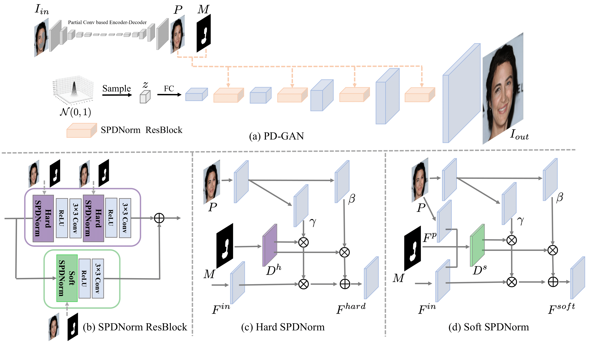

[](./LICENSE.md)

<span id="jump1"></span>
# PD-GAN


###  [Paper](https://openaccess.thecvf.com/content/CVPR2021/papers/Liu_PD-GAN_Probabilistic_Diverse_GAN_for_Image_Inpainting_CVPR_2021_paper.pdf) | [BibTex](#jump2)

PD-GAN: Probabilistic Diverse GAN for Image Inpainting
[Hongyu Liu](#jump1),  [Ziyu Wan](https://scholar.google.com/citations?user=RfIHcSoAAAAJ&hl=en), [Wei Huang](#jump1), [Yibing Song](https://ybsong00.github.io/), [Xintong Han](https://xthan.github.io/) and [JIng Liao](https://liaojing.github.io/html/).<br>
In CVPR 2021


## Installation

Clone this repo.
```bash
git clone https://github.com/KumapowerLIU/PD-GAN.git
```

Prerequisites
* Python3
* Pytorch >=1.0
* Tensorboard
* Torchvision
* pillow
* loguru


## Dataset Preparation

We use [Places2](http://places2.csail.mit.edu/), [CelebA](http://mmlab.ie.cuhk.edu.hk/projects/CelebA.html) and [Paris Street-View](https://github.com/pathak22/context-encoder) datasets. To train a model on the full dataset, download datasets from official websites.

Our model is trained on the irregular mask dataset provided by [Liu et al](https://arxiv.org/abs/1804.07723). You can download the publically available Irregular Mask Dataset from their [website](http://masc.cs.gmu.edu/wiki/partialconv).


## Code Structure

- `train.py`: the entry point for training.
- `train.py`: the entry point for test.
- `models/PConv.py`: defines the loss, model, optimizetion, foward, backward and others of Partial Conv.
- `models/PDGAN.py`: defines the loss, model, optimizetion, foward, backward and others of PDGAN.
- `models/network/pcconv.py`: defines the network of Partial Conv.
- `models/network/pdgan.py`: defines the network of PDGAN.
- `config/`: creates option lists using `argparse` package. More individuals are dynamically added in other files as well.
- `data/`: process the dataset before passing to the network.


## Training New Models
```bash
# To train on the you dataset for ParitalConv, for example.
python train.py --gt_root [the path of structure images]   --mask_root [the path of mask images] --model PConv
```

```bash
# To train on the you dataset for PDGAN, for example.
python train.py --gt_root [the path of structure images]   --mask_root [the path of mask images] --model PDGAN --pre_ckpt_PConv_EN_dir [the path of pre-trained PartialConv encoder] --pre_ckpt_PConv_DE_dir [the path of pre-trained PartialConv decoder]
```

There are many options you can specify. Please use `python train.py --help` or see the options
To log training, use `--./logs` for Tensorboard. The logs are stored at `logs/[name]`.


## Pre-trained weights and test model
There are [three folders](https://drive.google.com/drive/folders/1o9reT5_lFzGKBsrLlvck545nNInIAlPe?usp=sharing) to present a pre-trained model for three datasets, respectively. Currently, we only upload the pre-trained model of [Partical Conv](https://openaccess.thecvf.com/content_ECCV_2018/papers/Guilin_Liu_Image_Inpainting_for_ECCV_2018_paper.pdf). in each folder.
We implement the Partial Conv by ourselves.
## TODO
- [ ] upload the test code
- [ ] upload the pre-trained model of PDGAN.


<span id="jump2"></span>
### Citation
If you use this code for your research, please cite our papers.
```
@inproceedings{liu2021pd,
  title={Pd-gan: Probabilistic diverse gan for image inpainting},
  author={Liu, Hongyu and Wan, Ziyu and Huang, Wei and Song, Yibing and Han, Xintong and Liao, Jing},
  booktitle={Proceedings of the IEEE/CVF Conference on Computer Vision and Pattern Recognition},
  pages={9371--9381},
  year={2021}
}
```

### [License](./LICENSE.md)

The codes and the pretrained model in this repository are under the MIT license as specified by the LICENSE file.
The code is released for academic research use only. For commercial use, please contact [kumapower@hnu.edu.cn](#jump1).
